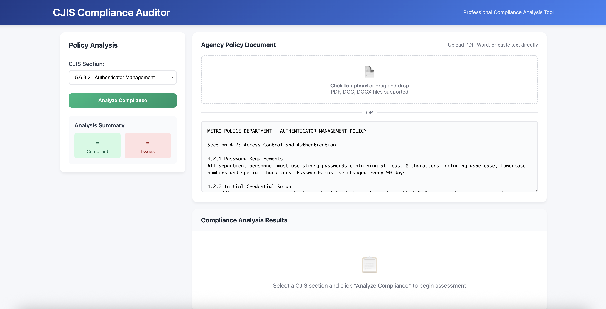

# CJIS Compliance Auditor 🛡️

**Live Demo:** [https://cjis-compliance-auditor.onrender.com](https://cjis-compliance-auditor.onrender.com)

**GitHub Repository:** [https://github.com/ptouhy/cjis-compliance-auditor.git](https://github.com/ptouhy/cjis-compliance-auditor.git)

---

A full-stack web application that automatically analyzes an agency's security policies against official FBI CJIS standards. Users can paste text or upload a document (PDF, DOCX, TXT) to generate an instant compliance report that identifies gaps and suggests improvements.

---



---

## Features

* **Text & File Analysis:** Accepts policy input via direct text paste or file upload (PDF, Microsoft Word `.docx`, and plain text `.txt` supported).
* **Compliance Reporting:** Systematically checks the policy against 5 major CJIS sections using keyword analysis.
* **Dynamic Results:** Generates a real-time report showing `Compliant`, `Non-Compliant`, and `Missing` items directly in the browser.

---

## Technology Stack

* **Backend:** Python
    * **FastAPI:** For building the web server and REST API.
    * **Uvicorn:** As the ASGI server to run the application.
    * **PyPDF2:** To extract text from PDF documents.
    * **python-docx:** To extract text from `.docx` Word documents.
* **Frontend:**
    * **HTML5:** For page structure.
    * **CSS3:** For all custom styling.
    * **Vanilla JavaScript:** To handle user interactions and asynchronous API calls (`fetch`).
* **Deployment:**
    * **Render:** Cloud platform for hosting the live web service.

---

## How to Run This Project Locally

1.  **Clone the repository:**
    ```bash
    git clone [https://github.com/ptouhy/cjis-compliance-auditor.git](https://github.com/ptouhy/cjis-compliance-auditor.git)
    cd cjis-compliance-auditor
    ```
   

2.  **Create and activate a virtual environment:**
    ```bash
    python3 -m venv venv
    source venv/bin/activate
    ```
    *(Use `.\venv\Scripts\activate` on Windows)*

3.  **Install the required packages:**
    ```bash
    pip3 install -r requirements.txt
    ```
   

4.  **Run the server:**
    ```bash
    uvicorn main:app --reload
    ```
   

5.  **Open the application in your browser:**
    * Go to `http://127.0.0.1:8000`